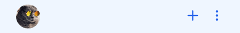

# Recent Chat Components

This section is responsible of displaying chats initiated and recieved and creating new chats using the Plus Icon. This section is made up of 3 Components:-

- **`ProfileAndNewChat:` ** The Section Header of this section is created via this component.

```js title="Section1.jsx"
import { ProfileAndNewChat } from "@Chattgator/components"

const SampleApp = () => {
	return (
		<>
			<ProfileAndNewChat />
		</>
	);
};

export default SampleApp;
```



- **`AddChat:` ** Modal to create new groups or add new DMs.

```js title="Section1.jsx"
import { AddChat } from "@Chattgator/components"

const SampleApp = () => {
	return (
		<>
			<AddChat />
		</>
	);
};

export default SampleApp;
```


- **`RecentChat:` ** Chat Cards to display chats initiated by the user.

```js title="Section1.jsx"
import { RecentChat } from "@Chattgator/components"

const SampleApp = () => {
	return (
		<>
			<RecentChat />
		</>
	);
};

export default SampleApp;
```

