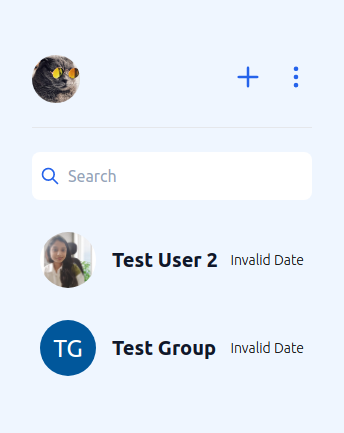
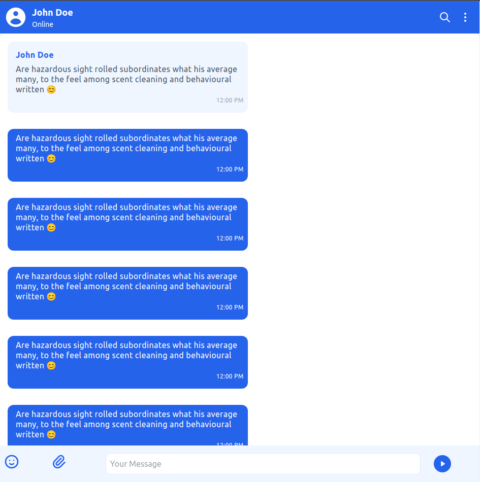
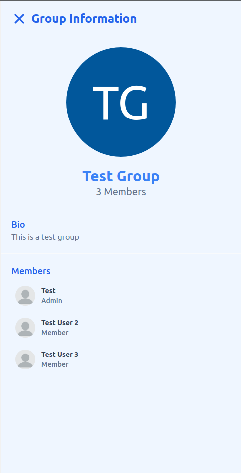
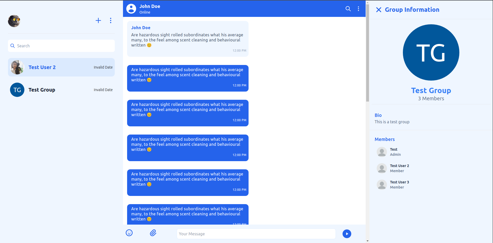

# Adding Chat UI

By now we've created our project and this **project dashboard** will provide you with the **credentials** needed to connect our Chat UI to the Backend. With these credentials, you'll be able to connect to the project and see all the chat messages in real-time.

## Accessing the Chat UI

The UI components in ChattY's Chat UI component directory `Chattgator` can be accessed with a simple ES6 import. This makes it easy to use and customize the chat interface for your needs. Whether you need a basic chat interface for a small project or a more complex one for a larger project, Chattgator has the tools you need.

```js title="App.jsx"
import React, { FC } from "react";
import { Container, RecentChatBody, ChatBody, BioSectionContainer } from "Chattgator/components";
```

We'll understand what these components are about later, but for now, we've understood how these components can be accessed. However, we need to know a bit more about how these components work together in order to really be able to use them effectively. In order to do that, we'll need to take a closer look at each of these components and how they interact with each other.

## Setting UI View with Prebuilt Containers

Now that we're able to access the UI components it's time to assemble our UI. We've imported a component named `Container` that assembles prebuilt the UI Cards for 3 sections of ChatUI:-

* **RecentChatBody:** A Pre-Assembled Container for viewing recent or previous chats of user. This container is responsible of displaying chats initiated and recieved and creating new chats using the Plus Icon.



* **ChatBody:** A pre-assembled container that allows you to view the chat interface of the user you are communicating with. This is the section where you can view chats in a group or direct messages.



* **BioSectionContainer:** A pre-assembled container that allows you to view the infomation of the group or the user you are chatting with. This is the section where you can view avatar, description and members of the group.



The above should give you an idea about the working of the UI containers. The above containers can be wrapped inside `Container` component to be viewed as a complete chat interface.

```js title="App.jsx"
import React, { FC } from "react";
import { Container, RecentChatBody, ChatBody, BioSectionContainer } from "Chattgator/components";

const App = () => {
	return (
		<Container>
			<RecentChatBody />
			<ChatBody />
			<BioSectionContainer />
		</Container>
	);
};

export default App;
```

Once you execute this app you'll have the ChatUI ready which'll look something like the above picture. However you won't be able to access the UI because we still haven't connected it to the backend. In order to do that we'll need the credentials mentioned before. Let's see how to connect the frontend to the backend!



## Connecting Backend via ChattGator Context

We've setted up the layout for the UI but to make it functional we'll need to connect it to our backend. Our backend enables you to:-

- View User and Group info
- Create New Groups and Chat
- Send and Receive messages in group and DMs
- View information of Group or User

In most cases you'll have to create multiple sockets and pay big bucks to a web developer to get this created but that's the issue we are trying to solve all you need to do is wrap the UI component we created in `App.jsx` inside the `ChattGatorProvider` context and pass user and project info.

```js title="index.jsx"
import React from "react";
import ReactDOM from "react-dom/client";
import App from "./App";
import { ChattGatorProvider } from "./contexts";
import "./index.css";

const root = ReactDOM.createRoot(document.getElementById("root") as HTMLElement);
root.render(
	<React.StrictMode>
		<ChattGatorProvider
			value={{
				projectConfig: {
					projectId: PROJECT_ID,
					projectSecret: PROJECT_SECRET_KEY,
				},
				user: {
					projectId: PROJECT_ID,
					name: USER_DISPLAY_NAME,
					userId: USER_ID,
					avatar: USER_AVATAR,
					userName: USERNAME,
					bio: USER_BIO,
				},
			}}
		>
			<App />
		</ChattGatorProvider>
	</React.StrictMode>
);
```

And that's it you now have a fully functioning chat app that is ready to be used.