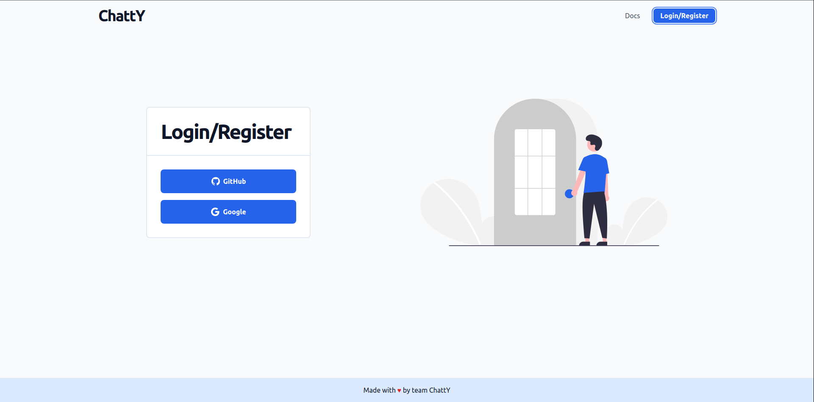

# Installation

ChattY is an npm package that helps you deploy a chat interface in your application without having to create any components for it. This makes it really easy to add a chat interface to your app without worrying about all the little details, and you can focus on the things that matter!

## Installing the Package

In order to access UI Kit you'll need to install the npm package for [**ChattY**](https://www.npmjs.com/settings/chatgator/packages). The installation is just like any other npm package:-

```
npm install chatgator
```

Now that you've install chatgator you'll be able to access to it's:-

- Pre-Assembled UI Containers
- MicroComponents for UI Customization
- Context to connect backend

## Login to ChattY

Great! We have the UI available to use but we'll need a backend to take care of the chat functionalities. This we can do by creating a project in ChattY's [**website**](www.google.com). Simply start by logging in with you gmail account:-



After successfully logging in, users are brought to the main page where they can start creating a new project. By clicking on the create project button, a new project can be made by inputting the project name, description, and other relevant information:-


Let's take a look at how to access project credentials and how we can add new users to the project.